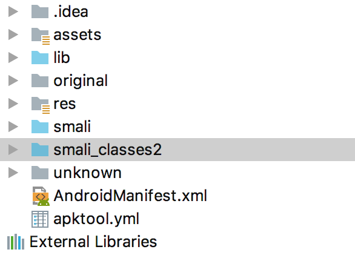
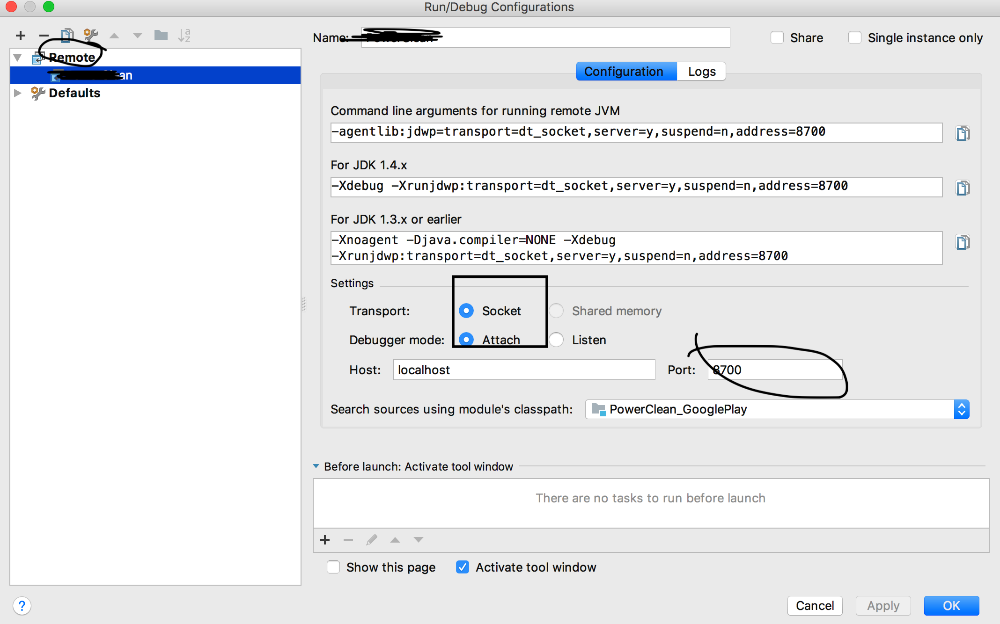
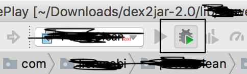
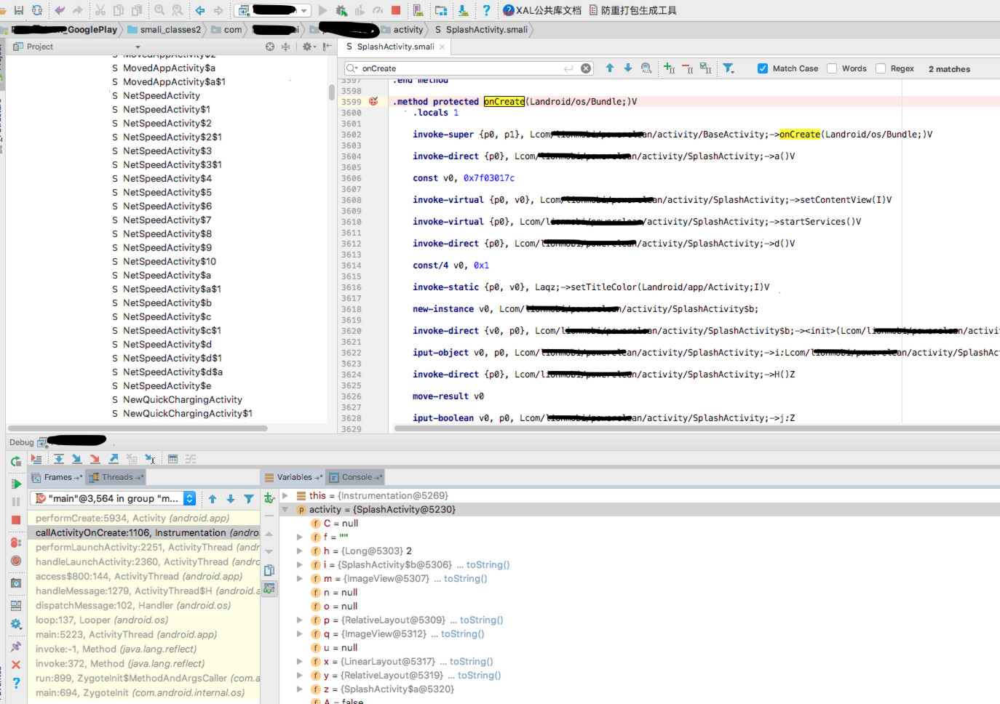

## 攻击其他应用：

我们常规的分析攻击其他应用分为两种方式

###### 1.静态分析
###### 2.动态调试
下面由简入难依次介绍：

先来介绍静态分析的一些基本方法：

常规的dex反编译时比较简单的，在这里讲解一下odex和vdex的反编译方法：

目前还没有发现常规工具可以直接破解odex和vdex的，需要先转为dex，再反编译。
下面介绍一下方法：
首先来简单的odex转dex

	java -jar baksmali-2.2.5.jar d /Users/xxx/Library/Android/sdk/1529567361524.odex

可能会有warning，但是忽略就行，我们再将smali文件转换成dex

	java -jar smali-2.2.5.jar a out -o output.dex

这样就可以反编译出来了

vdex转dex方法复杂一点：

1.配置电脑环境：（mac）

	brew install zlib-devel（教程是这么说的，但我当时没装上，使用的是 brew install zlib）
2.下载源码：

		https://github.com/anestisb/vdexExtractor.git
	
3.编译：

	./make.sh

4.到bin目录下：

	./vdexExtractor -i /Users/xxx/Library/Android/sdk/1529567361524.vdex -o /tmp -f --dis -l /tmp/dis.log

5.去/tmp目录下查看生成的dex

#### 攻击别人应用之动态调试：

攻击别人应用除了静态分析以外，更有效的方式是动态调试，
有两种常规的高效方式：
##### 第一种方式：通过xposed编写hook代码，在运行时，直接hook，查看输入输出内容。

xposed的安装和使用教程可以参考以下代码：

	https://github.com/xiepengchong/XposedInstalled.git

只要会写反射，使用xposed基本上不叫事，就是反射别人的代码。
##### 第二种方式：直接像调试自己的代码一样，打断点，进行断点调试
1）.首先在AndroidStudio中安装smalidea插件（下载smalidea-0.0.5.zip）：

	下载地址：https://bitbucket.org/JesusFreke/smali/downloads/
2）.反编译攻击apk，得到.smail文件（可以使用）

	java -jar apktool_2.3.4.jar d /Users/xxx/Desktop/xxx/xxx.apk
	
3）.将反编译获取到的文件通过android studio加载进来

4) .将smali**文件夹都 Mark Directory as -> source
	

5) .建立Remote测试工程

6).调试模式下启动攻击apk

	adb shell am start -n com.lxxxx/xxxx.activity.SplashActivity -D
	这时会停止在等待页面:waitting for Debugging....
	
7).android studio中运行调试：(需要先启动DDMS/Users/xxx/Library/Android/sdk/tools/monitor)

8.就会发现，在我们断点的地方停下了，我们就可以进行查看变量和调试了

注意:
这里面还有一些注意事项：

1.使用模拟器进行调试，我习惯使用genymotion

我习惯使用genymotion，下载ARM_Translation

下载地址：Android 5.x： [ARM_Translation_Lollipop](https://mega.nz/#!Mt8kyBxa!iVJYC7eI7ruLVoaarWIa85QOm_VlH53G0knVGpoSlAE)

下载地址：Android 6.x： [ARM_Translation_Marshmallow](https://mega.nz/#!p4lFlCZR!TFsb8dMqNdAJjKoCDPDDvNtcQdEB0-KkVlTgQVwG20s)

2.如果你需要调试的apk在模拟器上无法运行，那么就需要搞个工程模式机器了（或者自己编译一个eng版本的rom也可以）

	参考教程（此方法我并没有尝试）：https://blog.csdn.net/wmh_100200/article/details/78506407
	
3.使用xposed安装插件使其可以调试：
	
	1.准备一个root手机
	2.安装xposed
	3.安装xposed 插件 Xdebuggable
	4.develop options -> Select debug app -> 选择你要调试的apk就可以了

##### 第三种方式：我们直接将apk重打包
	1.使用apktool进行反编译
	2.修改smali文件，改成我们想要的效果
	3.重新打包
	4.签名
	5.运行
PS：这种方法网上一搜一大把,在此只说两个命令：

	java -jar /Users/xxx/Downloads/dex2jar-2.0/lib/apktool_2.3.4.jar -r d xxx.apk
	java -jar /Users/xxx/Downloads/dex2jar-2.0/lib/apktool_2.3.4.jar b xxx
	jarsigner -keystore debug.keystore -storepass android -signedjar signed.apk unsigned.apk androiddebugkey

	生成的apk在xxx文件夹的disk目录下。
	第一个命令-r不是必须加的，不加是最好的，但有时可能不加重新打包的时候，会报错。

这里调试的时候，一般要接触smali语言，虽然读起来不太容易懂，但是确实是很简单的，而且我们在调试的时候，只是加一些log，或修改一些常量的比较多。
这里写几个简单的例子

1.增加log，输出String类型：

    const-string v2, "TAG"//Log中的TAG值
    invoke-static {v2, v1}, Landroid/util/Log;->i(Ljava/lang/String;Ljava/lang/String;)I//v1为输出的String内容
	根据加的位置，调整使用的是v2还是其他的

2.增加log，输出URL网址

    const-string v1, "TAG"//Log中的TAG值
    invoke-virtual {p1}, Ljava/net/URL;->toString()Ljava/lang/String;//输入args的第一位是p1（非静态方法），类型是URL
    move-result-object v0 //上面方法的结果赋值给v0，这是v0是string类型了
    invoke-static {v1, v0}, Landroid/util/Log;->i(Ljava/lang/String;Ljava/lang/String;)I //输出String

3.增加log,输出int类型（Log.v("TAG",""+1)）

    const-string v0, "TAG"
    new-instance v1, Ljava/lang/StringBuilder; //new 一个StringBuilder
    invoke-direct {v1}, Ljava/lang/StringBuilder;-><init>()V //初始化
    const-string v2, "" //定义一个字符串变量 “”
    invoke-virtual {v1, v2}, Ljava/lang/StringBuilder;->append(Ljava/lang/String;)Ljava/lang/StringBuilder;//append ""
    move-result-object v1 //结果赋值给v1
    invoke-virtual {v1, p1}, Ljava/lang/StringBuilder;->append(I)Ljava/lang/StringBuilder; //append 第一个参数值（非静态方法）
    move-result-object v1 //结果赋值给v1
    invoke-virtual {v1}, Ljava/lang/StringBuilder;->toString()Ljava/lang/String; //v1.toString方法
    move-result-object v1 //结果赋值给v1
    invoke-static {v0, v1}, Landroid/util/Log;->v(Ljava/lang/String;Ljava/lang/String;)I //log 输出
从上面看我们一个简单的操作，对于smali来说这么复杂，所以写代码的时候，可以考虑如何优化使执行时更加效率。

关于smali的详细教程参考：

[dalvik_opcodes](http://pallergabor.uw.hu/androidblog/dalvik_opcodes.html)

## 防护别人攻击：
防护别人攻击最重要的一点就是不想让别人看到我们的代码逻辑，在java中书写代码基本上和裸奔没有什么区别，所以我们一般会认为在native中书写代码就安全了。下面让我们来试试：

我们只是简单的实现一个方法，获取屏幕的宽和高：

	static void check_screen_size(JNIEnv *env, jobject activity){
    	jclass wrapperClass = env->FindClass("android/view/ContextThemeWrapper");
    	jmethodID getResourcesId = env->GetMethodID(wrapperClass,"getResources","()Landroid/content/res/	Resources;");
    	jobject resources = env->CallObjectMethod(activity,getResourcesId);

    	jclass resourceClass = env->FindClass("android/content/res/Resources");
    	jmethodID getDisplayMetricsId = env->GetMethodID(resourceClass,"getDisplayMetrics","()Landroid/util/DisplayMetrics;");
    	jobject dm = env->CallObjectMethod(resources,getDisplayMetricsId);

    	jclass dmClass = env->FindClass("android/util/DisplayMetrics");
    	jfieldID widthPixelId = env->GetFieldID(dmClass,"widthPixels","I");
    	jfieldID HeightPixelId = env->GetFieldID(dmClass,"heightPixels","I");
    	jint widthPixel = env->GetIntField(dm,widthPixelId);
    	jint heightPixel = env->GetIntField(dm,HeightPixelId);
	}

下面我们使用IDA进行so的反编译看一下，长什么样：
	
	.text:00000FA0 ; =============== S U B R O U T I N E =======================================
	.text:00000FA0
	.text:00000FA0 ; Attributes: static bp-based frame
	.text:00000FA0
	.text:00000FA0 ; void __fastcall check_screen_size(JNIEnv *env, jobject activity)
	.text:00000FA0 _ZL17check_screen_sizeP7_JNIEnvP8_jobject
	.text:00000FA0                                         ; DATA XREF: .data:gMethods↓o
	.text:00000FA0 env = R0                                ; JNIEnv *
	.text:00000FA0 activity = R1                           ; jobject
	.text:00000FA0 ; __unwind {
	.text:00000FA0                 PUSH            {R4-R7,LR}
	.text:00000FA2                 ADD             R7, SP, #0xC
	.text:00000FA4                 PUSH.W          {R8-R10}
	.text:00000FA8                 MOV             R4, env
	.text:00000FAA env = R4                                ; JNIEnv *
	.text:00000FAA activity = R5                           ; jobject
	.text:00000FAA                 MOV             activity, R1
	.text:00000FAC                 LDR             R0, [env]
	.text:00000FAE                 LDR             R1, =(aAndroidViewCon - 0xFB6)
	.text:00000FB0                 LDR             R2, [R0,#0x18]
	.text:00000FB2                 ADD             R1, PC  ; "android/view/ContextThemeWrapper"
	.text:00000FB4                 MOV             R0, env
	.text:00000FB6                 BLX             R2
	.text:00000FB8                 MOV             R1, R0
	.text:00000FBA wrapperClass = R1                       ; jclass
	.text:00000FBA                 LDR             R0, [env]
	.text:00000FBC                 LDR             R2, =(aGetresources - 0xFC8)
	.text:00000FBE                 LDR             R3, =(aLandroidConten_0 - 0xFCA)
	.text:00000FC0                 LDR.W           R6, [R0,#0x84]
	.text:00000FC4                 ADD             R2, PC  ; "getResources"
	.text:00000FC6                 ADD             R3, PC  ; "()Landroid/content/res/Resources;"
	.text:00000FC8                 MOV             R0, env
	.text:00000FCA                 BLX             R6
	.text:00000FCC                 MOV             R2, R0  ; methodID
	.text:00000FCE getResourcesId = R2                     ; jmethodID
	.text:00000FCE                 MOV             R0, env ; this
	.text:00000FD0                 MOV             R1, R5  ; obj
	.text:00000FD2 activity = R1                           ; jobject
	.text:00000FD2                 BLX             	j__ZN7_JNIEnv16CallObjectMethodEP8_jobjectP10_jmethodIDz ; _JNIEnv::CallObjectMethod(_jobject 	*,_jmethodID *,...)
	.text:00000FD6                 MOV             R5, R0
	.text:00000FD8 resources = R5                          ; jobject
	.text:00000FD8                 LDR             R0, [env]
	.text:00000FDA                 LDR             R1, =(aAndroidContent - 0xFE2)
	.text:00000FDC                 LDR             R2, [R0,#0x18]
	.text:00000FDE                 ADD             R1, PC  ; "android/content/res/Resources"
	.text:00000FE0                 MOV             R0, env
	.text:00000FE2                 BLX             R2
	.text:00000FE4                 MOV             R1, R0
	.text:00000FE6 resourceClass = R1                      ; jclass
	.text:00000FE6                 LDR             R0, [env]
	.text:00000FE8                 LDR             R2, =(aGetdisplaymetr - 0xFF4)
	.text:00000FEA                 LDR             R3, =(aLandroidUtilDi - 0xFF6)
	.text:00000FEC                 LDR.W           R6, [R0,#0x84]
	.text:00000FF0                 ADD             R2, PC  ; "getDisplayMetrics"
	.text:00000FF2                 ADD             R3, PC  ; "()Landroid/util/DisplayMetrics;"
	.text:00000FF4                 MOV             R0, env
	.text:00000FF6                 BLX             R6
	.text:00000FF8                 MOV             R2, R0  ; methodID
	.text:00000FFA getDisplayMetricsId = R2                ; jmethodID
	.text:00000FFA                 MOV             R0, env ; this
	.text:00000FFC                 MOV             R1, resources ; obj
	.text:00000FFE                 BLX             j__ZN7_JNIEnv16CallObjectMethodEP8_jobjectP10_jmethodIDz ; _JNIEnv::CallObjectMethod(_jobject *,_jmethodID *,...)
	.text:00001002                 MOV             R9, R0
	.text:00001004 dm = R9                                 ; jobject
	.text:00001004                 LDR             R0, [env]
	.text:00001006                 LDR             R1, =(aAndroidUtilDis - 0x100E)
	.text:00001008                 LDR             R2, [R0,#0x18]
	.text:0000100A                 ADD             R1, PC  ; "android/util/DisplayMetrics"
	.text:0000100C                 MOV             R0, env
	.text:0000100E                 BLX             R2
	.text:00001010                 MOV             R6, R0
	.text:00001012 dmClass = R6                            ; jclass
	.text:00001012                 LDR             R0, [env]
	.text:00001014                 LDR.W           R8, =(aI_0 - 0x1020)
	.text:00001018                 MOV             R1, dmClass
	.text:0000101A                 LDR             R2, =(aWidthpixels - 0x1026)
	.text:0000101C                 ADD             R8, PC  ; "I"
	.text:0000101E                 LDR.W           resources, [R0,#0x178]
	.text:00001022                 ADD             R2, PC  ; "widthPixels"
	.text:00001024                 MOV             R0, env
	.text:00001026                 MOV             R3, R8
	.text:00001028                 BLX             R5
	.text:0000102A                 MOV             R10, R0
	.text:0000102C widthPixelId = R10                      ; jfieldID
	.text:0000102C                 LDR             R0, [env]
	.text:0000102E                 LDR             R2, =(aHeightpixels - 0x103C)
	.text:00001030                 MOV             R1, dmClass
	.text:00001032                 MOV             R3, R8
	.text:00001034                 LDR.W           R5, [R0,#0x178]
	.text:00001038                 ADD             R2, PC  ; "heightPixels"
	.text:0000103A                 MOV             R0, env
	.text:0000103C                 BLX             R5
	.text:0000103E                 MOV             dmClass, R0
	.text:00001040 HeightPixelId = R6                      ; jfieldID
	.text:00001040                 LDR             R0, [env]
	.text:00001042                 MOV             R1, dm
	.text:00001044                 MOV             R2, widthPixelId
	.text:00001046                 LDR.W           R3, [R0,#0x190]
	.text:0000104A                 MOV             R0, env
	.text:0000104C                 BLX             R3
	.text:0000104E                 LDR             R0, [env]
	.text:00001050                 MOV             R1, dm
	.text:00001052                 MOV             R2, HeightPixelId
	.text:00001054                 LDR.W           R3, [R0,#0x190]
	.text:00001058                 MOV             R0, env
	.text:0000105A                 POP.W           {R8-widthPixelId}
	.text:0000105E                 POP.W           {env-R7,LR}
	.text:00001062                 BX              R3
	.text:00001062 ; End of function check_screen_size(_JNIEnv *,_jobject *)
	
从上面可以看出来，方法名，调用顺序，参数名其实都是完美暴漏的，大概看一眼就能知道代码逻辑，所以使用c/c++写代码只能拦住小菜鸟，对于高手来说，其实和java写的代码没啥区别。

所以我们要是想要保密，一定要将我们的代码进一步保护起来。
首先我们想把方法名去掉（去符号表）：

strip ***.so

	.text:00000FA0 ; =============== S U B R O U T I N E =======================================
	.text:00000FA0
	.text:00000FA0 ; Attributes: bp-based frame
	.text:00000FA0
	.text:00000FA0 sub_FA0                                 ; DATA XREF: .data:00005024↓o
	.text:00000FA0 ; __unwind {
	.text:00000FA0                 PUSH            {R4-R7,LR}
	.text:00000FA2                 ADD             R7, SP, #0xC
	.text:00000FA4                 PUSH.W          {R8-R10}
	.text:00000FA8                 MOV             R4, R0
	.text:00000FAA                 MOV             R5, R1
	.text:00000FAC                 LDR             R0, [R4]
	.text:00000FAE                 LDR             R1, =(aAndroidViewCon - 0xFB6)
	.text:00000FB0                 LDR             R2, [R0,#0x18]
	.text:00000FB2                 ADD             R1, PC  ; "android/view/ContextThemeWrapper"
	.text:00000FB4                 MOV             R0, R4
	.text:00000FB6                 BLX             R2
	.text:00000FB8                 MOV             R1, R0
	.text:00000FBA                 LDR             R0, [R4]
	.text:00000FBC                 LDR             R2, =(aGetresources - 0xFC8)
	.text:00000FBE                 LDR             R3, =(aLandroidConten_0 - 0xFCA)
	.text:00000FC0                 LDR.W           R6, [R0,#0x84]
	.text:00000FC4                 ADD             R2, PC  ; "getResources"
	.text:00000FC6                 ADD             R3, PC  ; "()Landroid/content/res/Resources;"
	.text:00000FC8                 MOV             R0, R4
	.text:00000FCA                 BLX             R6
	.text:00000FCC                 MOV             R2, R0
	.text:00000FCE                 MOV             R0, R4
	.text:00000FD0                 MOV             R1, R5
	.text:00000FD2                 BLX             j__ZN7_JNIEnv16CallObjectMethodEP8_jobjectP10_jmethodIDz ; _JNIEnv::CallObjectMethod(_jobject *,_jmethodID *,...)
	.text:00000FD6                 MOV             R5, R0
	.text:00000FD8                 LDR             R0, [R4]
	.text:00000FDA                 LDR             R1, =(aAndroidContent - 0xFE2)
	.text:00000FDC                 LDR             R2, [R0,#0x18]
	.text:00000FDE                 ADD             R1, PC  ; "android/content/res/Resources"
	.text:00000FE0                 MOV             R0, R4
	.text:00000FE2                 BLX             R2
	.text:00000FE4                 MOV             R1, R0
	.text:00000FE6                 LDR             R0, [R4]
	.text:00000FE8                 LDR             R2, =(aGetdisplaymetr - 0xFF4)
	.text:00000FEA                 LDR             R3, =(aLandroidUtilDi - 0xFF6)
	.text:00000FEC                 LDR.W           R6, [R0,#0x84]
	.text:00000FF0                 ADD             R2, PC  ; "getDisplayMetrics"
	.text:00000FF2                 ADD             R3, PC  ; "()Landroid/util/DisplayMetrics;"
	.text:00000FF4                 MOV             R0, R4
	.text:00000FF6                 BLX             R6
	.text:00000FF8                 MOV             R2, R0
	.text:00000FFA                 MOV             R0, R4
	.text:00000FFC                 MOV             R1, R5
	.text:00000FFE                 BLX             j__ZN7_JNIEnv16CallObjectMethodEP8_jobjectP10_jmethodIDz ; _JNIEnv::CallObjectMethod(_jobject *,_jmethodID *,...)
	.text:00001002                 MOV             R9, R0
	.text:00001004                 LDR             R0, [R4]
	.text:00001006                 LDR             R1, =(aAndroidUtilDis - 0x100E)
	.text:00001008                 LDR             R2, [R0,#0x18]
	.text:0000100A                 ADD             R1, PC  ; "android/util/DisplayMetrics"
	.text:0000100C                 MOV             R0, R4
	.text:0000100E                 BLX             R2
	.text:00001010                 MOV             R6, R0
	.text:00001012                 LDR             R0, [R4]
	.text:00001014                 LDR.W           R8, =(aI_0 - 0x1020)
	.text:00001018                 MOV             R1, R6
	.text:0000101A                 LDR             R2, =(aWidthpixels - 0x1026)
	.text:0000101C                 ADD             R8, PC  ; "I"
	.text:0000101E                 LDR.W           R5, [R0,#0x178]
	.text:00001022                 ADD             R2, PC  ; "widthPixels"
	.text:00001024                 MOV             R0, R4
	.text:00001026                 MOV             R3, R8
	.text:00001028                 BLX             R5
	.text:0000102A                 MOV             R10, R0
	.text:0000102C                 LDR             R0, [R4]
	.text:0000102E                 LDR             R2, =(aHeightpixels - 0x103C)
	.text:00001030                 MOV             R1, R6
	.text:00001032                 MOV             R3, R8
	.text:00001034                 LDR.W           R5, [R0,#0x178]
	.text:00001038                 ADD             R2, PC  ; "heightPixels"
	.text:0000103A                 MOV             R0, R4
	.text:0000103C                 BLX             R5
	.text:0000103E                 MOV             R6, R0
	.text:00001040                 LDR             R0, [R4]
	.text:00001042                 MOV             R1, R9
	.text:00001044                 MOV             R2, R10
	.text:00001046                 LDR.W           R3, [R0,#0x190]
	.text:0000104A                 MOV             R0, R4
	.text:0000104C                 BLX             R3
	.text:0000104E                 LDR             R0, [R4]
	.text:00001050                 MOV             R1, R9
	.text:00001052                 MOV             R2, R6
	.text:00001054                 LDR.W           R3, [R0,#0x190]
	.text:00001058                 MOV             R0, R4
	.text:0000105A                 POP.W           {R8-R10}
	.text:0000105E                 POP.W           {R4-R7,LR}
	.text:00001062                 BX              R3
	.text:00001062 ; End of function sub_FA0
	
去符号表有两个好处：
1.方法名去掉了，增大了反编译难度
2.大大的减少so大小
我在测试的时候：169,096  减少到了 18,124 （接近十倍的差距）

Android如果发布release包，一般会自动去符号表

从上面的代码来看，还是又一些字符串是能被看到的,我们将字符串隐藏起来：
首先我们通过最笨也是最简单的方法：

	void check_screen_size(JNIEnv *env, jobject activity){

    char* ContextThemeWrapperClassName = (char[]){'a','n','d','r','o','i','d','/','v','i','e','w','/','C','o','n','t','e','x','t','T','h','e','m','e','W','r','a','p','p','e','r','\0'};
    char* getResources = (char[]){'g','e','t','R','e','s','o','u','r','c','e','s','\0'};
    char* getResourcesSig = (char[]){'(',')','L','a','n','d','r','o','i','d','/','c','o','n','t','e','n','t','/','r','e','s','/','R','e','s','o','u','r','c','e','s',';','\0'};
    char* getResourcesClassName = (char[]){'a','n','d','r','o','i','d','/','c','o','n','t','e','n','t','/','r','e','s','/','R','e','s','o','u','r','c','e','s','\0'};
    char* getDisplayMetricsMethodName = (char[]){'g','e','t','D','i','s','p','l','a','y','M','e','t','r','i','c','s','\0'};
    char* getDisplayMetricsSig = (char[]){'(',')','L','a','n','d','r','o','i','d','/','u','t','i','l','/','D','i','s','p','l','a','y','M','e','t','r','i','c','s',';','\0'};
    char* getDisplayMetricsClassName = (char[]){'a','n','d','r','o','i','d','/','u','t','i','l','/','D','i','s','p','l','a','y','M','e','t','r','i','c','s','\0'};

    jclass wrapperClass = env->FindClass(ContextThemeWrapperClassName);
    jmethodID getResourcesId = env->GetMethodID(wrapperClass,getResources,getResourcesSig);
    jobject resources = env->CallObjectMethod(activity,getResourcesId);

    jclass resourceClass = env->FindClass(getResourcesClassName);
    jmethodID getDisplayMetricsId = env->GetMethodID(resourceClass,getDisplayMetricsMethodName,getDisplayMetricsSig);
    jobject dm = env->CallObjectMethod(resources,getDisplayMetricsId);

    jclass dmClass = env->FindClass(getDisplayMetricsClassName);
    jfieldID widthPixelId = env->GetFieldID(dmClass,"widthPixels","I");
    jfieldID HeightPixelId = env->GetFieldID(dmClass,"heightPixels","I");
    jint widthPixel = env->GetIntField(dm,widthPixelId);
    jint heightPixel = env->GetIntField(dm,HeightPixelId);
}
	
直接将字符串：

	"android/view/ContextThemeWrapper"

改为

	char* wrapper = (char[]){'a','n','d','r','o','i','d','/','v','i','e','w','/','C','o','n','t','e','x','t','T','h','e','m','e','W','r','a','p','p','e','r','\0'};
	PS:下面这种写法是不可以的
    char wrapper[] = {'a','n','d','r','o','i','d','/','v','i','e','w','/','C','o','n','t','e','x','t','T','h','e','m','e','W','r','a','p','p','e','r','\0'};

在看效果：

	.text:0000080C ; =============== S U B R O U T I N E =======================================
	.text:0000080C
	.text:0000080C ; Attributes: bp-based frame
	.text:0000080C
	.text:0000080C ; check_screen_size(_JNIEnv *, _jclass *, _jobject *)
	.text:0000080C                 EXPORT _Z17check_screen_sizeP7_JNIEnvP7_jclassP8_jobject
	.text:0000080C _Z17check_screen_sizeP7_JNIEnvP7_jclassP8_jobject
	.text:0000080C                                         ; CODE XREF: check_screen_size(_JNIEnv *,_jclass *,_jobject *)+8↑j
	.text:0000080C                                         ; DATA XREF: LOAD:00000230↑o ...
	.text:0000080C
	.text:0000080C var_BC          = -0xBC
	.text:0000080C var_9C          = -0x9C
	.text:0000080C var_8A          = -0x8A
	.text:0000080C var_6C          = -0x6C
	.text:0000080C var_4A          = -0x4A
	.text:0000080C var_3D          = -0x3D
	.text:0000080C var_1C          = -0x1C
	.text:0000080C
	.text:0000080C ; __unwind {
	.text:0000080C                 PUSH            {R4-R7,LR}
	.text:0000080E                 ADD             R7, SP, #0xC
	.text:00000810                 PUSH.W          {R8-R10}
	.text:00000814                 SUB             SP, SP, #0xC0
	.text:00000816                 MOV             R4, R0
	.text:00000818                 LDR             R0, =(__stack_chk_guard_ptr - 0x824)
	.text:0000081A                 MOV             R5, R2
	.text:0000081C                 SUB.W           R1, R7, #-var_3D
	.text:00000820                 ADD             R0, PC  ; __stack_chk_guard_ptr
	.text:00000822                 LDR             R0, [R0] ; __stack_chk_guard
	.text:00000824                 LDR             R0, [R0]
	.text:00000826                 STR             R0, [SP,#0xD8+var_1C]
	.text:00000828                 LDR             R0, [R4]
	.text:0000082A                 LDR             R2, [R0,#0x18]
	.text:0000082C                 MOV             R0, R4
	.text:0000082E                 BLX             R2
	.text:00000830                 MOV             R1, R0
	.text:00000832                 LDR             R0, [R4]
	.text:00000834                 SUB.W           R2, R7, #-var_4A
	.text:00000838                 ADD             R3, SP, #0xD8+var_6C
	.text:0000083A                 LDR.W           R6, [R0,#0x84]
	.text:0000083E                 MOV             R0, R4
	.text:00000840                 BLX             R6
	.text:00000842                 MOV             R2, R0
	.text:00000844                 MOV             R0, R4
	.text:00000846                 MOV             R1, R5
	.text:00000848                 BLX             j__ZN7_JNIEnv16CallObjectMethodEP8_jobjectP10_jmethodIDz ; _JNIEnv::CallObjectMethod(_jobject *,_jmethodID *,...)
	.text:0000084C                 MOV             R5, R0
	.text:0000084E                 LDR             R0, [R4]
	.text:00000850                 SUB.W           R1, R7, #-var_8A
	.text:00000854                 LDR             R2, [R0,#0x18]
	.text:00000856                 MOV             R0, R4
	.text:00000858                 BLX             R2
	.text:0000085A                 MOV             R1, R0
	.text:0000085C                 LDR             R0, [R4]
	.text:0000085E                 ADD             R2, SP, #0xD8+var_9C
	.text:00000860                 ADD             R3, SP, #0xD8+var_BC
	.text:00000862                 LDR.W           R6, [R0,#0x84]
	.text:00000866                 MOV             R0, R4
	.text:00000868                 BLX             R6
	.text:0000086A                 MOV             R2, R0
	.text:0000086C                 MOV             R0, R4
	.text:0000086E                 MOV             R1, R5
	.text:00000870                 BLX             j__ZN7_JNIEnv16CallObjectMethodEP8_jobjectP10_jmethodIDz ; _JNIEnv::CallObjectMethod(_jobject *,_jmethodID *,...)
	.text:00000874                 MOV             R9, R0
	.text:00000876                 LDR             R0, [R4]
	.text:00000878                 MOV             R1, SP
	.text:0000087A                 LDR             R2, [R0,#0x18]
	.text:0000087C                 MOV             R0, R4
	.text:0000087E                 BLX             R2
	.text:00000880                 MOV             R6, R0
	.text:00000882                 LDR             R0, [R4]
	.text:00000884                 LDR.W           R8, =(aI - 0x890)
	.text:00000888                 MOV             R1, R6
	.text:0000088A                 LDR             R2, =(aWidthpixels - 0x896)
	.text:0000088C                 ADD             R8, PC  ; "I"
	.text:0000088E                 LDR.W           R5, [R0,#0x178]
	.text:00000892                 ADD             R2, PC  ; "widthPixels"
	.text:00000894                 MOV             R0, R4
	.text:00000896                 MOV             R3, R8
	.text:00000898                 BLX             R5
	.text:0000089A                 MOV             R10, R0
	.text:0000089C                 LDR             R0, [R4]
	.text:0000089E                 LDR             R2, =(aHeightpixels - 0x8AC)
	.text:000008A0                 MOV             R1, R6
	.text:000008A2                 MOV             R3, R8
	.text:000008A4                 LDR.W           R5, [R0,#0x178]
	.text:000008A8                 ADD             R2, PC  ; "heightPixels"
	.text:000008AA                 MOV             R0, R4
	.text:000008AC                 BLX             R5
	.text:000008AE                 MOV             R6, R0
	.text:000008B0                 LDR             R0, [R4]
	.text:000008B2                 MOV             R1, R9
	.text:000008B4                 MOV             R2, R10
	.text:000008B6                 LDR.W           R3, [R0,#0x190]
	.text:000008BA                 MOV             R0, R4
	.text:000008BC                 BLX             R3
	.text:000008BE                 LDR             R0, [R4]
	.text:000008C0                 MOV             R1, R9
	.text:000008C2                 MOV             R2, R6
	.text:000008C4                 LDR.W           R3, [R0,#0x190]
	.text:000008C8                 MOV             R0, R4
	.text:000008CA                 BLX             R3
	.text:000008CC                 LDR             R0, =(__stack_chk_guard_ptr - 0x8D4)
	.text:000008CE                 LDR             R1, [SP,#0xD8+var_1C]
	.text:000008D0                 ADD             R0, PC  ; __stack_chk_guard_ptr
	.text:000008D2                 LDR             R0, [R0] ; __stack_chk_guard
	.text:000008D4                 LDR             R0, [R0]
	.text:000008D6                 SUBS            R0, R0, R1
	.text:000008D8                 ITTT EQ
	.text:000008DA                 ADDEQ           SP, SP, #0xC0
	.text:000008DC                 POPEQ.W         {R8-R10}
	.text:000008E0                 POPEQ           {R4-R7,PC}
	.text:000008E2                 BLX             __stack_chk_fail
	.text:000008E2 ; End of function check_screen_size(_JNIEnv *,_jclass *,_jobject *)

当然除了这个方法以外，还有很多，例如我写一个加&解密函数，暴漏的都是加密之后的，使用的时候，解谜，只要解密函数不被破译，就是安全的，在此不再尝试。

我最常用的还是char*这种方式，简单好用，而且反编译效果也非常好。
当然替换的时候，费点劲，所以我们可以写一个方法，帮助我们替换

    private String output(String input){
        StringBuilder builder = new StringBuilder();
        int size = input.length();
        for(int i = 0;i<size;i++){
            if(i == 0){
                builder.append("{");
                builder.append("'");
                builder.append(input.charAt(i));
                builder**.append("',");
            } else if(i != size -1){
                builder.append("'");
                builder.append(input.charAt(i));
                builder.append("',");
            } else {
                builder.append("'");
                builder.append(input.charAt(i));
                builder.append("',");
                builder.append("\'\0\'}");
            }
        }
        return builder.toString();
    }

这个方法看上去是很完美的，但是其实我们这个写法是有问题的，但为了防止破解，我们也就忍了，但是cmake可不会忍，在Android项目下编译release包的时候，会将char* 内容混淆消失，导致找不到。
通过查看release编译规则：

					"flags" : "  --target=armv7-none-linux-androideabi --gcc-toolchain=/Users/xxx/Library/Android/sdk/ndk-bundle/toolchains/arm-linux-androideabi-4.9/prebuilt/darwin-x86_64 --sysroot=/Users/xxx/Library/Android/sdk/ndk-bundle/sysroot  -Dmhl_EXPORTS -isystem /Users/xxx/Library/Android/sdk/ndk-bundle/sources/cxx-stl/llvm-libc++/include -isystem /Users/xxx/Library/Android/sdk/ndk-bundle/sources/android/support/include -isystem /Users/xxx/Library/Android/sdk/ndk-bundle/sources/cxx-stl/llvm-libc++abi/include  -isystem /Users/xxx/Library/Android/sdk/ndk-bundle/sysroot/usr/include/arm-linux-androideabi -D__ANDROID_API__=16 -g -DANDROID -ffunction-sections -funwind-tables -fstack-protector-strong -no-canonical-prefixes -march=armv7-a -mfloat-abi=softfp -mfpu=vfpv3-d16 -mthumb -Wa,--noexecstack -Wformat -Werror=format-security -std=c++11 -Os -fPIC    -c ",
可以看到，这里有一个优化级别 -Os 这个级别已经是很高了，

通过man查看
man clang

所以我们需要将release包的优化级别降低：

        externalNativeBuild {
            cmake {
                cppFlags ""
                arguments "-DCMAKE_CXX_FLAGS_RELEASE=-O0"
            }
        }
        
这样编译出来的release包才能正常使用。

##### 上面的方式可以大大的增加破解难度，但是我们是牺牲了混淆级别来达到的目的，这样最终会导致我们的so大小略有增加。所以对于so大小大一点的功能来说，我们更推荐用下面这种方式

	1.先对字符串进行加密
	2.运行的时候，解密
举个实例:

	字符串：android/bluetooth/BluetoothAdapter
	
	先按位与0x60异或得到char类型的字符串：
	
	static char str_android_bluetooth_BluetoothAdapter[] = {0, 1,14,4,18,15,9,4,79,2,12,21,5,20,15,15,20,8,79,34,12,21,5,20,15,15,20,8,33,4,1,16,20,5,18,'\0'};

	运行的时候，进行解析：

	env->FindClass(convert(str_android_bluetooth_BluetoothAdapter));

	static char* convert(char* arr) {
    	if(arr[0] == 0) {
        	int index =1;
        	while(arr[index] != '\0') {
            	index++;
        	}
        	int length = index;
        	for (int i = 1; i < length; i++) {
            	arr[i] = arr[i] ^ 0x60;
        	}
        	arr[0] = 1;
    	}
    	return  &arr[1];
	}

此方法为加密效果比较好，而且不需要降低混淆级别，但书写和可读性是很麻烦的，可以自行根据加密场景选择不同方案。

